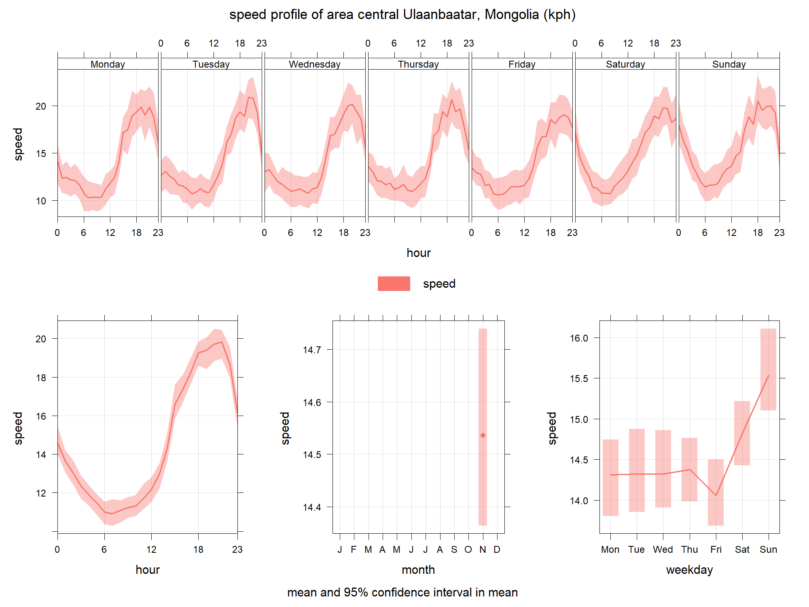

# Google distance matrix API using OSM

Programatically request the time taken between any two points using the
Google distance matrix API. Anyone can sign up for an account and every
month get 10,000 free requests (after that it is \$0.005 per request). I
wrote a wrapper around this which uses OSM road network data and
requests the journey time for each link for each hour period for the
following week.

Example below requests the time taken for each link taken directly from
OSM for a random remote location: Ulaanbaatar, Mongolia, with speed plot
for each link and overall profile for the roads shown.

Overall speed profile for all the roads

